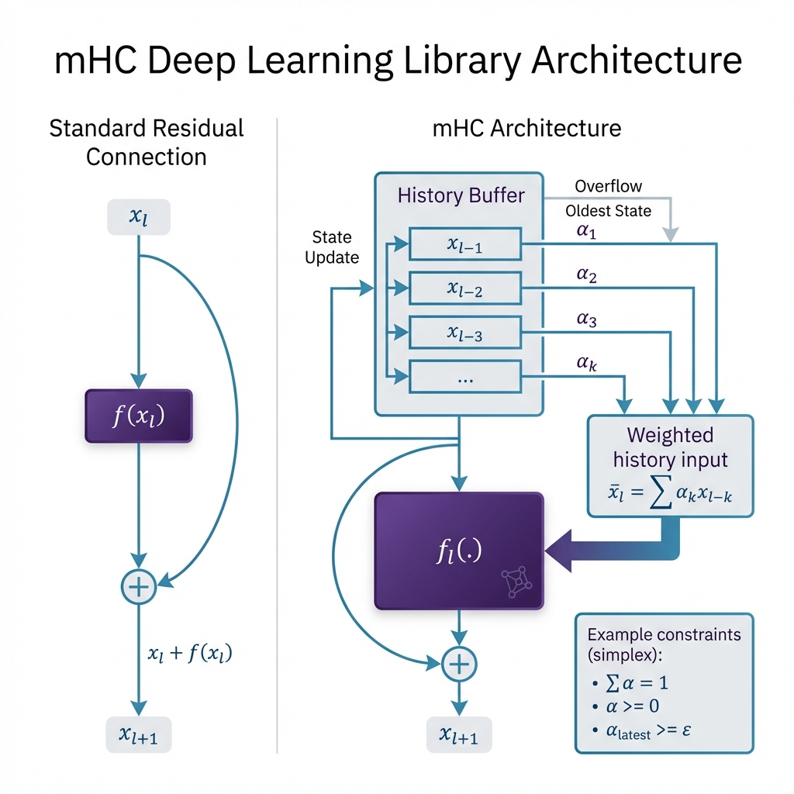

# mhc — Manifold-Constrained Hyper-Connections

<div align="center">

[](https://www.python.org/downloads/)
[](https://pytorch.org/get-started/locally/)
[](https://opensource.org/licenses/MIT)
[](https://github.com/gm24med/MHC/actions/workflows/ci.yml)
[](https://github.com/astral-sh/ruff)

**Richer skip connections for deeper, more stable neural networks**

[Documentation](https://github.com/gm24med/MHC/tree/main/docs) • [Examples](https://github.com/gm24med/MHC/tree/main/examples) • [Paper](#citation) • [Contributing](#contributing)

</div>

---

## 🎯 What is mHC?

`mhc` is a PyTorch library that extends residual connections (ResNet-style skip connections) to **mix multiple historical network states** instead of just the immediate previous layer. This enables:

- ✅ **Deeper networks** with better gradient flow
- ✅ **Improved stability** through geometric constraints
- ✅ **Richer representations** by combining multiple past states
- ✅ **Drop-in replacement** for existing ResNet architectures

<div align="center">

</div>

---

## 🚀 Quick Start

### Installation

```bash
# From source (recommended for now)
git clone https://github.com/gm24med/MHC.git
cd MHC
pip install -e .

# Or with uv
uv pip install -e .
```

### 30-Second Example

```python
import torch
import torch.nn as nn
from mhc import MHCSequential

# Create a model with mHC skip connections
model = MHCSequential([
    nn.Linear(64, 64),
    nn.ReLU(),
    nn.Linear(64, 64),
    nn.ReLU(),
    nn.Linear(64, 32)
], max_history=4, mode="mhc", constraint="simplex")

# Use it like any PyTorch model
x = torch.randn(8, 64)
output = model(x)  # History is managed automatically!
```

### Inject into Existing Models

Transform any model to use mHC with one line:

```python
from mhc import inject_mhc
import torchvision.models as models

# Load a standard ResNet
model = models.resnet50(pretrained=True)

# Inject mHC skip connections
inject_mhc(model, target_types=nn.Conv2d, max_history=4)

# Train as usual - now with richer skip connections!
```

---

## 🤔 Why mHC?

### The Problem with Standard ResNets

Standard residual connections only use the **immediate previous state**:

$$
x_{l+1} = x_l + f(x_l)
$$

This works well, but it limits information flow to a single layer and makes very deep stacks depend on repeated, short-range skips.

### The mHC Solution

mHC learns a **history-aware skip** that mixes a sliding window of past representations:

$$
x_{l+1} = f(x_l) + \sum_{k=l-H+1}^{l} \alpha_{l,k}\, x_k
$$

Where:
- $H$ is the history length (the size of the sliding window).
- $\alpha_{l,k}$ are **learned mixing weights** for layer $l$.
- The weights are **geometrically constrained** to stay stable:
  - **Simplex**: nonnegative, sums to 1 (convex mixing).
  - **Identity-preserving**: maintains a strong direct path.
  - **Doubly stochastic**: balanced mixing across history.

This gives deeper layers a richer, but controlled, access to earlier features without destabilizing gradients.

### When to Use mHC?

| Use Case | Benefit |
|----------|---------|
| **Very deep networks (50+ layers)** | Better gradient flow, reduced vanishing gradients |
| **Training stability issues** | Geometric constraints prevent gradient explosion |
| **Limited data** | Richer feature mixing improves generalization |
| **Fine-tuning pre-trained models** | Inject mHC to boost performance |

### What Changes in Practice

- **Same forward API**: mHC plugs into existing backbones without changing training loops.
- **More expressive skips**: each layer can reweight multiple past states instead of a single residual.
- **Controlled mixing**: constraints keep the skip path well-behaved, even for long histories.

---

## 📊 Performance Highlights

> **Note**: Comprehensive benchmarks coming in v0.5. Early experiments show:

- ✅ **Improved convergence** on deep MLPs (50+ layers)
- ✅ **Better gradient flow** compared to standard ResNet
- ✅ **Stable training** even with 200+ layer networks
- ✅ **Minimal overhead** (~5-10% additional compute)

---

## 🧠 Core Concepts

### Mixing Modes

| Mode | Description | Use Case |
|------|-------------|----------|
| `residual` | Standard ResNet (x + f(x)) | Baseline comparison |
| `hc` | Unconstrained hyper-connections | Experimental |
| `mhc` | **Manifold-constrained** (recommended) | Production use |

### Constraint Types

| Constraint | Formula | Guarantees |
|------------|---------|------------|
| `simplex` | Σα = 1, α ≥ 0 | Convex combination |
| `identity` | Simplex + α_latest ≥ ε | Identity preservation |
| `matrix` | Doubly stochastic | Advanced feature mixing |

### History Buffer

The `HistoryBuffer` manages the sliding window of past states:

```python
from mhc import HistoryBuffer

buffer = HistoryBuffer(max_history=4, detach_history=True)
buffer.append(x0)  # Add states
buffer.append(x1)
states = buffer.get()  # Retrieve for mixing
```

---

## 🛠️ Advanced Usage

### Custom Skip Connection

```python
from mhc import MHCSkip, HistoryBuffer

skip = MHCSkip(
    mode="mhc",
    max_history=4,
    constraint="identity",
    epsilon=0.1,        # Minimum weight on latest state
    temperature=1.0,    # Softmax temperature
    init="identity"     # Initialization strategy
)

# Note: auto_project can handle limited shape changes (same spatial dims).
# It is not a general shape adapter.

# In your forward pass
history_buffer = HistoryBuffer(max_history=4)
for layer in layers:
    x = layer(x)
    x = skip(x, history_buffer.get())
    history_buffer.append(x)
```

### Matrix Mixing (Advanced)

For even richer historical feature mixing:

```python
from mhc.layers import MatrixMHCSkip

skip = MatrixMHCSkip(
    max_history=4,
    doubly_stochastic=True,
    iterations=10
)
```

---

## 📚 Documentation

- **[Core Concepts](docs/concepts.md)** - Understanding hyper-connections
- **[API Reference](docs/api.md)** - Complete API documentation
- **[Examples](examples/)** - Runnable code examples
- **[Tutorials](examples/)** - Step-by-step guides

## ⚙️ Configuration
### TensorFlow (Optional)

```bash
pip install "mhc[tf]"
```

```python
from mhc.tf import TFMHCSequential
```

### TensorFlow Graph-Safe History

```python
from mhc.tf import TFMHCSequentialGraph
```

### Visualization (Optional)

```bash
pip install "mhc[viz]"
```

### Logging

```python
import logging

logging.basicConfig(level=logging.INFO)
logging.getLogger("mhc").info("mHC logging enabled")
```

### Central Configuration (Optional)

```toml
[tool.mhc]
max_history = 6
mode = "mhc"
constraint = "identity"
epsilon = 0.1
temperature = 1.0
detach_history = true
clear_history_each_forward = true
auto_project = false
history_scope = "module"
```

```python
from mhc import load_config_from_toml, set_default_config

config = load_config_from_toml("pyproject.toml")
set_default_config(config)
```

For Python <3.11, install TOML support:

```bash
pip install "mhc[config]"
```

---

## 🧪 Development

### Running Tests

```bash
# Run all tests
uv run pytest

# Run with coverage
uv run pytest --cov=mhc

# Run specific test
uv run pytest tests/test_mhc_skip.py -v
```

### Code Quality

```bash
# Linting
uv run ruff check .

# Formatting
uv run ruff format .

# Type checking
uv run mypy mhc
```

---

## 📜 Roadmap

- [x] **v0.1**: Core `MHCSkip` & `HistoryBuffer`
- [x] **v0.2**: Simplex & Identity Constraints
- [x] **v0.3**: Matrix Mixing (Doubly Stochastic)
- [x] **v0.4**: Managed Layers & Model Injection
- [ ] **v0.5**: Deep Stability Benchmark Suite
- [ ] **v0.6**: PyPI Release & Documentation Site
- [ ] **v0.7**: PyTorch Lightning & Hugging Face Integration
- [ ] **v0.8**: Pre-trained Model Zoo

See the [full roadmap](https://github.com/gm24med/MHC/issues) for details.

---

## 🤝 Contributing

We welcome contributions! Here's how to get started:

1. **Fork the repository**
2. **Create a feature branch** (`git checkout -b feature/amazing-feature`)
3. **Make your changes** and add tests
4. **Run tests and linting** (`uv run pytest && uv run ruff check .`)
5. **Commit your changes** (`git commit -m 'feat: add amazing feature'`)
6. **Push to your branch** (`git push origin feature/amazing-feature`)
7. **Open a Pull Request**

See [CONTRIBUTING.md](CONTRIBUTING.md) for detailed guidelines.

---

## 📖 Citation

If you use mHC in your research, please cite:

```bibtex
@software{mhc2025,
  title={mHC: Manifold-Constrained Hyper-Connections for Deep Neural Networks},
  author={Your Name},
  year={2025},
  url={https://github.com/gm24med/MHC}
}
```

---

## 📄 License

Distributed under the **MIT License**. See [LICENSE](LICENSE) for more information.

---

## 🙏 Acknowledgments

- Inspired by research on skip connections, DenseNet, and Highway Networks
- Built with [PyTorch](https://pytorch.org/)
- Developed with [uv](https://github.com/astral-sh/uv) and [ruff](https://github.com/astral-sh/ruff)

---

<div align="center">

**⭐ Star us on GitHub if you find mHC useful!**

[Report Bug](https://github.com/gm24med/MHC/issues) • [Request Feature](https://github.com/gm24med/MHC/issues) • [Discussions](https://github.com/gm24med/MHC/discussions)

</div>
